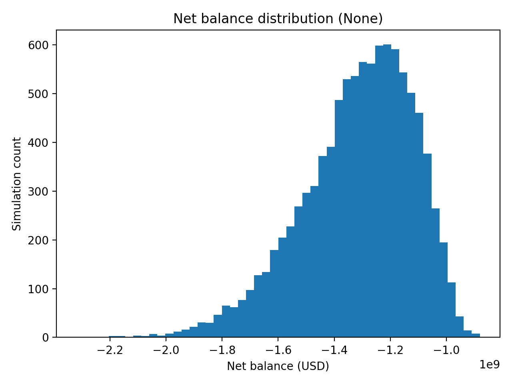
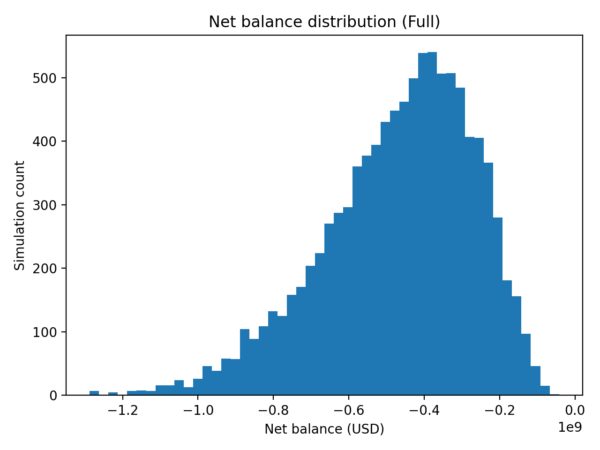

# Can NYC Afford Fare-Free Transit?

## Overview
This project evaluates the financial feasibility of implementing **fare-free bus transit** using a **Monte Carlo simulation**. Rather than relying on a single point estimate, the analysis quantifies the **distribution of possible budget outcomes** under uncertainty in ridership response, operating costs, and funding replacement strategies.

The goal is to answer the question:

> *If NYC eliminates bus fares, what is the probability of running a budget deficit, and how large would the required subsidy be under different funding scenarios?*

---

## Data
Baseline inputs were sourced from **MTA public transit budget and ridership reports**, including:
- Annual bus fare revenue  
- Annual bus operating costs  
- Annual bus ridership  

These values represent the current operating baseline before any fare-free policy is applied.

Behavioral and cost responses (e.g., ridership growth, cost inflation) were **not treated as fixed values**. Instead, they were modeled as probability distributions to demonstrate real world uncertainty.

---

## Methodology

### Model Structure
- **Time horizon:** 1 year  
- **Simulations:** 10,000 per scenario  
- **Total runs:** 30,000  

Each simulation models:
- Lost fare revenue from eliminating fares  
- Increased operating costs due to higher ridership  
- Replacement funding based on the selected scenario  

### Funding Scenarios
Three funding scenarios were evaluated:
1. **No replacement funding**
2. **Partial replacement funding (50%)**
3. **Full fare replacement funding (100%)**

---

---

### 1. Net Balance Distribution — No Replacement

**Interpretation**

- Eliminating fares with no replacement funding leads to **severe and consistent deficits**.
- The distribution is tightly centered around a **~$1.3B annual deficit**.
- This scenario represents the highest operational risk.

---

### 2. Net Balance Distribution — Partial Replacement (50%)

**Interpretation**

- Partial replacement reduces the magnitude of the deficit but **does not eliminate it**.
- Median outcomes improve, but all simulations remain negative.
- This suggests that **partial subsidies meaningfully help**, but are insufficient alone.

---

### 3. Net Balance Distribution — Full Replacement

**Interpretation**

- Full fare replacement produces the least severe deficits.
- However, **all simulated outcomes remain negative**.
- The remaining deficit is driven by **higher service and operating costs**, not fare loss.

---

### 4. Required Annual Subsidy (Full Replacement)

**Interpretation**

- Even under full fare replacement, the system requires **substantial additional funding**.
- Median required subsidy is approximately **$400–500M annually**.
- In adverse scenarios, required subsidies exceed **$1B per year**.
- This highlights significant **tail risk** that must be considered in policy planning.

---

## Key Takeaways
- Fare-free bus transit is **not budget-neutral** under realistic assumptions.
- Replacing fare revenue alone is insufficient to maintain fiscal balance.
- Increased ridership leads to higher operating costs that require **ongoing subsidies**.
- Monte Carlo simulation provides a clearer picture of **risk and uncertainty** than point estimates.

---

## Limitations
- Simplified cost structure (no capital or long-term infrastructure modeling)
- One-year time horizon
- Does not capture long-term land-use, productivity, or equity effects
- Assumes no capacity hard limits on service expansion

---

## Next Steps
Potential extensions of this analysis include:
- Multi-year budget simulations
- Partial or off-peak fare-free policies
- Capacity constraints and diminishing returns to service expansion
- Scenario-specific funding mechanisms

---

## Final Insight
**Fare-free transit requires planning for sustained operational subsidies.**  
Quantifying not just expected costs, but downside risk, is essential for future informed decision making.
