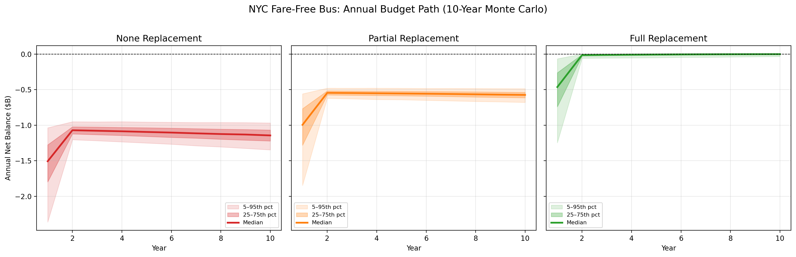
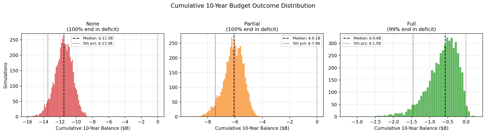
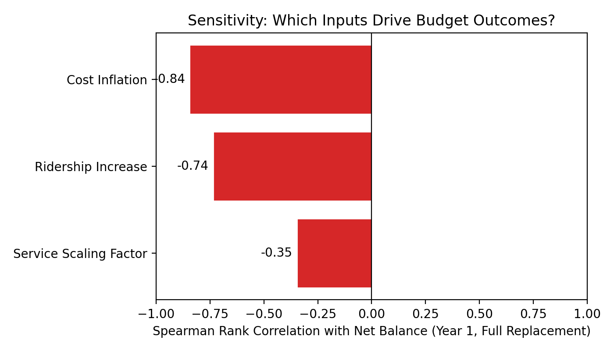

# Can NYC Afford Fare-Free Transit?
### A Monte Carlo Budget Analysis of NYC Bus Fare Elimination

---

## Overview

This project models the 10-year fiscal impact of eliminating bus fares across the NYC MTA system. The core question is not whether a deficit occurs — that much is nearly certain — but how large it is, how it compounds over time, and which variables drive the most risk.

The analysis uses Monte Carlo simulation (5,000 runs per scenario) to produce full probability distributions of budget outcomes rather than point estimates. Input distributions were calibrated from real MTA ridership and operating cost data, supplemented by ridership response data from six fare-free transit pilots across the U.S. and Europe.

---

## Data Sources

**MTA Ridership** — Daily estimated bus ridership pulled from the NY Open Data Socrata API (`vxuj-8kew`), aggregated to annual totals. COVID years (2020–2021) excluded from distribution fitting due to non-representative ridership collapse.

**MTA Operating Costs** — Monthly NYCT operating expense data pulled from the NY Open Data Socrata API (`yg77-3tkj`), filtered to Actual scenario figures and aggregated annually.

**Fare-Free Pilot Data** — Ridership response observations from six cities that implemented fare-free transit policies: Kansas City MO (2020), Tallahassee FL (2020), Olympia WA (2020), Hasselt Belgium (1997), Luxembourg (2020), and Dunkirk France (2018). Observed ridership increases ranged from 12.5% to 30%.

**Baseline Inputs (2025)**

| Metric | Value |
|---|---|
| Annual Bus Fare Revenue | $850M |
| Annual Bus Operating Cost | $6.2B |
| Annual Bus Ridership | 1.9B trips |
| Fare Revenue as % of Operating Cost | 13.7% |

---

## Methodology

### Model Structure

- **Time horizon:** 10 years
- **Simulations:** 5,000 per scenario (15,000 total)
- **Year 1:** Full ridership shock applied (fare-free policy takes effect)
- **Years 2–10:** Organic ridership growth (~1%/yr), compounding cost inflation, and accumulating fare revenue counterfactual

### Input Distributions

Rather than using fixed Low/Mean/High assumption ranges, distributions were fit directly from empirical data.

| Parameter | Distribution | Source |
|---|---|---|
| Ridership Increase (Year 1) | Normal(22.9%, 6.4%) | Fitted from 6 fare-free pilot cities |
| Cost Inflation (Annual) | Normal(μ, σ) | Fitted from MTA historical operating cost data |
| Service Scaling Factor | Normal(40%, 10%) | Proportion of ridership growth that translates to added service cost |
| Revenue Forecast Noise | Normal(0%, 2.5%) | Budget uncertainty |

**Key methodological upgrade:** Ridership increase and cost inflation are sampled jointly from a bivariate normal distribution with correlation ρ = 0.55, reflecting the real-world relationship where higher ridership directly drives higher operating costs. Earlier versions of this model treated these as independent draws, which allowed physically implausible combinations.

### Funding Scenarios

| Scenario | Replacement Rate | Description |
|---|---|---|
| None | 0% | No new funding source — full deficit absorbed |
| Partial | 50% | Half of lost fare revenue replaced by external subsidy |
| Full | 100% | All lost fare revenue replaced — only operational cost growth remains unfunded |

---

## Results

### Annual Budget Path (Fan Chart)

All three scenarios produce deficits in Year 1 that stabilize after the initial ridership shock. The uncertainty bands widen through Year 2 as the policy shock interacts with cost inflation, then narrow as the model settles into a compounding steady state. Under no replacement funding, the median annual deficit stabilizes around **-$1.1B**. Partial replacement narrows this to roughly **-$0.5B** annually. Full replacement converges near **$0** but remains in deficit in 99% of simulations due to ongoing service cost growth.

---

### Cumulative 10-Year Budget Outcomes

| Scenario | Median 10-Year Balance | 5th Percentile | % Simulations in Deficit |
|---|---|---|---|
| No Replacement | -$11.5B | -$13.5B | 100% |
| Partial Replacement | -$6.1B | -$7.4B | 100% |
| Full Replacement | -$0.6B | -$1.5B | 99% |

Even full fare replacement — which covers every dollar of lost ticket revenue — results in a median 10-year cumulative deficit of $600M, driven entirely by the additional operating costs of serving higher ridership. In adverse scenarios (5th percentile), that figure reaches $1.5B over the decade.

The spread of the Full Replacement distribution is notably wider than the other two scenarios, reflecting greater sensitivity to the ridership shock magnitude. When ridership grows more than expected, the operating cost burden grows proportionally — and replacement funding, which is pegged to the baseline fare revenue, does not cover the difference.

---

### Sensitivity Analysis

Spearman rank correlations between input variables and Year 1 net balance under Full Replacement:

| Input | Correlation with Net Balance |
|---|---|
| Cost Inflation | -0.84 |
| Ridership Increase | -0.74 |
| Service Scaling Factor | -0.35 |

Cost inflation is the dominant driver of outcome variance, slightly ahead of ridership increase. This is a meaningful finding for policy: even if ridership response is lower than projected, high operating cost growth can produce large deficits independently. Service scaling factor — how aggressively the agency expands service to meet demand — has a smaller but non-trivial effect, suggesting that a more measured service expansion policy could partially offset cost risk.

---

## Key Findings

Fare-free bus transit is not fiscally self-sustaining under any scenario modeled. The question is not whether NYC would run a deficit but how large a sustained subsidy commitment would be required.

Replacing lost fare revenue covers only part of the problem. Fare revenue represents roughly 14% of total bus operating costs. Eliminating fares triggers ridership growth that drives operating costs higher — a dynamic that replacement funding tied to the original fare revenue baseline does not address.

The 10-year framing changes the policy math significantly. A one-year model suggests the annual deficit under full replacement is manageable. Extended over a decade, the cumulative commitment — median $600M, worst-case $1.5B — represents a substantial and growing budget obligation that would require a durable, indexed funding mechanism, not a one-time appropriation.

Cost inflation is the biggest risk factor, not ridership uncertainty. Policymakers tend to focus on whether ridership projections are accurate, but the sensitivity analysis shows operating cost growth is a larger driver of fiscal variance. Any fare-free policy should be stress-tested against high-inflation operating environments, not just optimistic and pessimistic ridership scenarios.

---

## Limitations

- NYCT cost data covers bus and subway combined; bus-specific cost inflation is approximated
- Pilot city data skews toward smaller systems — NYC's scale may produce different elasticity
- No capital expenditure modeling (fleet expansion, depot capacity)
- Service scaling treated as exogenous; in practice it is a policy lever
- Does not model induced demand effects beyond Year 1 ridership shock
- One-year organic growth rate post-shock (1%/yr) is a simplifying assumption

---

## Potential Extensions

- Multi-year ridership elasticity curves with diminishing returns post-shock
- Capacity constraint modeling — service quality degradation at high ridership without fleet expansion
- Partial fare-free policies (off-peak only, low-income targeted, select routes)
- Scenario-specific funding mechanisms (congestion pricing, property tax increment, federal formula grants)
- Equity analysis using MTA origin-destination demographic data